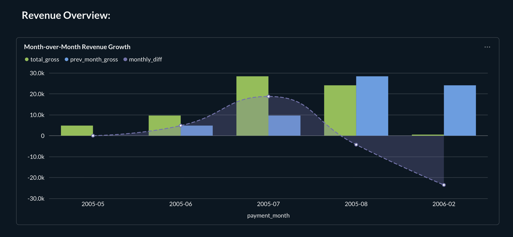
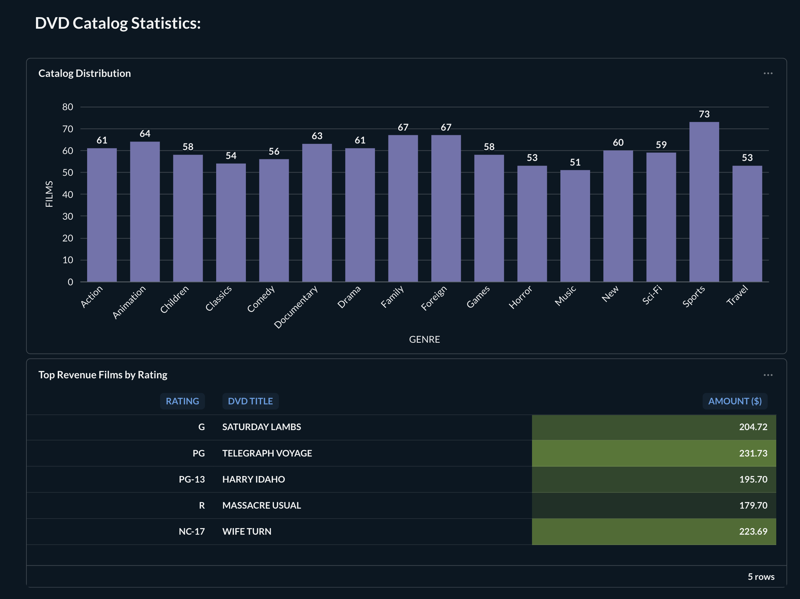
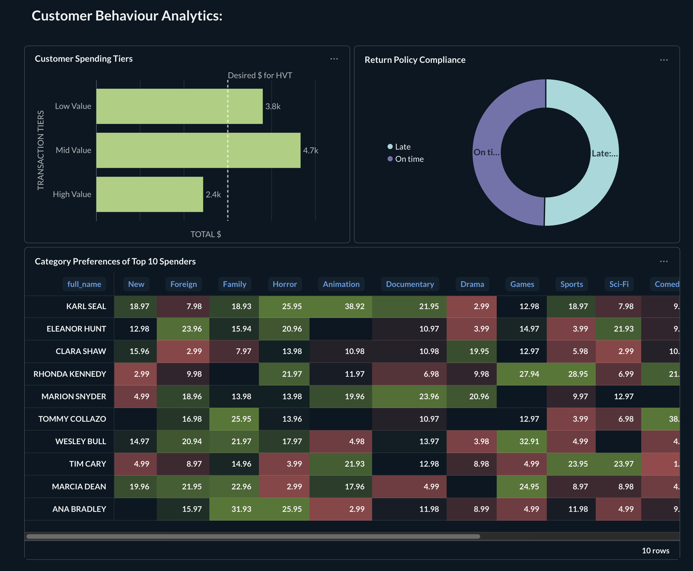

# Sakila Data Engineering & BI Pipeline


<br>

## Project Overview

The executive management team at the DVD store chain Sakila Entertainment seeks to gain deeper insights into the company’s rental business. Their goals are to:
* Analyze the performance of top products
* Identify opportunities for operational improvement
* Make data-driven decisions to optimize business outcomes

This project delivers a comprehensive **end-to-end data engineering solution**. It transforms the legacy, normalized _Sakila rental database_ (OLTP) into a high-performance, denormalized _Star Schema Data Warehouse_ (OLAP), enabling advanced analytics and robust business intelligence.

Key features of the solution include:
- **Containerized pipeline:** All components are packaged with `Docker` for portability and consistency.
- **Automated orchestration:** Data flow is managed and automated via `docker-compose.yaml`, ensuring seamless deployment and operation.
- **Incremental loading:** A _watermarking_ strategy is implemented to support efficient, incremental data updates.
- **Executive dashboards:** The pipeline delivers actionable insights directly to decision-makers through tailored Jupyter Notebook and _Metabase_ dashboards.

This architecture empowers Sakila Entertainment to unlock the full potential of their data, driving strategic improvements and operational excellence.


### Architecture

**Source (OLTP)** $\rightarrow$ **ETL (Python)** $\rightarrow$ **Warehouse (OLAP)** $\rightarrow$ **Analysis (BI)**

1. **Source:** `sakila` (Transactional MySQL database).
2. **ETL:** Custom Python pipeline with **Incremental Loading** (Watermark strategy).
3. **Target:** `sakila_star` (Dimensional Data Warehouse).
4. **Consumption:**
    * **Jupyter Notebook:** For deep-dive statistical analysis (`JupySQL`, `Seaborn`).
    * **Metabase:** For self-service executive dashboards.

<br>

## Tech Stack & Key Skills

| Component | Technology | Key Skills Demonstrated |
| :--- | :--- | :--- |
| **Orchestration** | Docker Compose | Multi-container networking (DB, App, BI), Volume persistence |
| **Database** | MySQL 8.0 | Schema Design (3NF $\to$ Star Schema), DDL, Indexing |
| **ETL Engine** | Python (Pandas) | **Incremental Upserts**, Watermarking, Data Cleaning |
| **Analysis** | SQL / JupySQL | CTEs, Window Functions (`RANK`, `LAG`), Aggregations |
| **Visualization** | Metabase / Seaborn | Dashboard design, Heatmaps, Time-series forecasting |


<br>

## Installation & Setup

### 1. Prerequisites

*   Docker & Docker Compose installed on your machine.

### 2. Clone & Launch

```bash
# Clone the repository
git clone https://github.com/yourusername/sakila-data-engineering.git
```
```bash
# Start the environment (approx. 60 seconds to initialize)
docker-compose up -d
```

### 3. Verify Containers

Run `docker ps` in the terminal to ensure the following are active:
- **sakila-mysql (Port 3306)** - The Database Host
- **sakila-notebook (Port 8888)** - The ETL & Analysis Environment
- **sakila-metabase (Port 3000)** - The BI Dashboard

<br>

By following these steps, you'll have a fully functional data engineering pipeline ready to use.
- http://localhost:8888 - The ETL & Analysis Environment (Jupyter Notebook)
- http://localhost:3000 - The BI Dashboard (Metabase)
- http://localhost:3306 - The Database Host (MySQL Workbench)


<br>

## Project Execution

### Phase 1: Data Modeling & Schema Design

> File: `sql/10_sakila_star-schema.sql`

Before any data movement, I architected a Star Schema optimized for analytical queries (OLAP). This involved writing the SQL DDL to define the warehouse structure:
* **Fact Table (fact_rental)**:
    * The central table containing over 16,000 transaction records.
    * It connects to dimensions via Foreign Keys (`film_id`, `customer_id`, etc.) and includes performance indexes (`idx_rental_date`).
* **Dimension Tables**: Denormalized tables to reduce join complexity. Examples:
    * `dim_customer`: Merges customer profile + address + city + country.
    * `dim_film`: Consolidates film details + language.

* **Infrastructure Tables**:
    * `etl_state`: A custom table designed to store Watermarks (`last_success_ts`) for each pipeline, enabling the **"_incremental ETL logic_"**.

* **Data Integrity**:
    * Implemented `ON DUPLICATE KEY UPDATE` logic in the schema to ensure idempotency.

<br>

### Phase 2: The Incremental ETL Pipeline

> File: `notebooks/01_incremental_ETL_pipeline.ipynb`

The ETL process moves data from Source to Target using `Python` and `Pandas`.

- **Extraction:** Queries the source `sakila` DB using `WHERE last_update > watermark`.
- **Transformation:** Cleans timestamps and handles NaN values for SQL compatibility.
- **Loading:** Executes Upserts (Update-Insert) into the `sakila_star` warehouse.
- **Watermarking:** After a successful load, the `etl_state` table is updated with the latest timestamp, ensuring the next run only processes new data.

<br>

### Phase 3: Data Analysis

> File: `notebooks/02_data_analysis.ipynb`

I utilized the Data Warehouse to answer critical business questions using advanced SQL.

1. **Financial Volatility (Window Functions):**
I calculated Month-over-Month Revenue Growth using the LAG() window function to detect financial trends.
Insight: Identifies immediate periods of growth vs. decline.

2. **Top Products (`RANK()`):**
I identified the highest-grossing movie for each MPAA rating category (G, PG, R, etc.) using RANK() OVER (PARTITION BY rating).

3. **VIP Customer Analysis _(Pivoting)_:**
I analyzed the Top 20 highest-spending customers, pivoting their spending data to generate a Heatmap of category preferences (e.g., specific customers preferring Animation vs. Sports).

<br>

### Phase 4: Metabase Executive Dashboard

> Access: `http://localhost:3000`

I deployed a persistent **"Sakila Executive Overview"** dashboard in Metabase, organised into three strategic categories to display the notebook's queries via different graph types.

#### **Revenue Overview:**


> **MoM Revenue Volatility:** A Bar Chart displaying the month-over-month growth or decline in total revenue.

#### **DVD Catalog Statistics**


> **Catalog Distribution:** Bar chart visualizing the count of films per Genre.

> **Top Revenue Films:** A Table with conditional formatting (deep to light green) identifying the #1 highest-grossing movie per Rating.


#### **Customer Behaviour**


> **Spending Tiers:** A Row-based Bar Chart segmenting customers into Low/Mid/High value tiers, featuring a target line for desired high-value transaction volume.

> **Return Policy Compliance:** Pie chart showing the ratio of Late vs. On-Time returns.

> **VIP Heatmap:** A Pivot Table/Heatmap visualizing our Top 10 customers and their total spending amount per film category.
